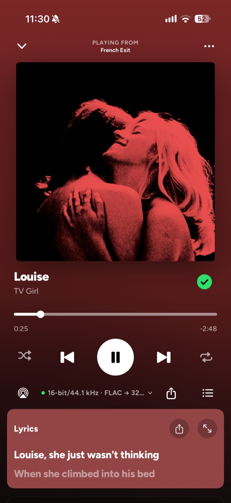
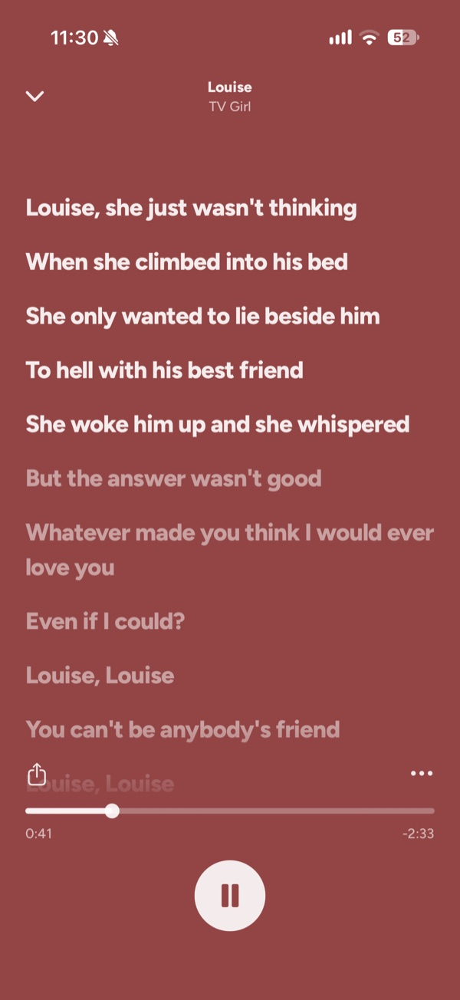
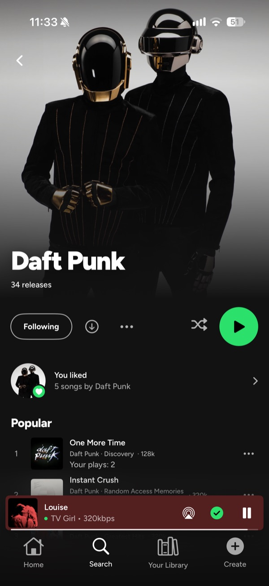
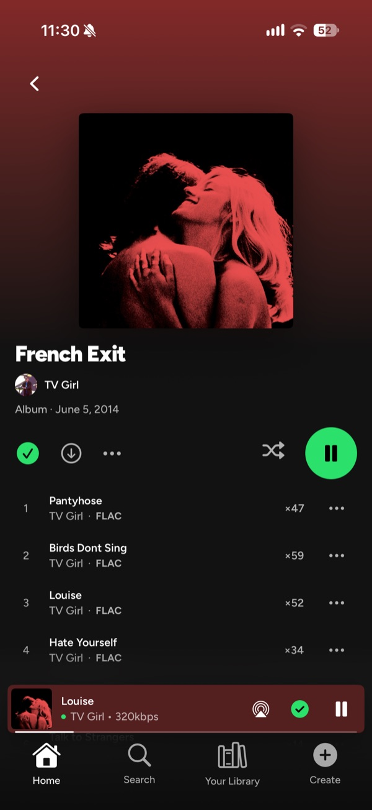
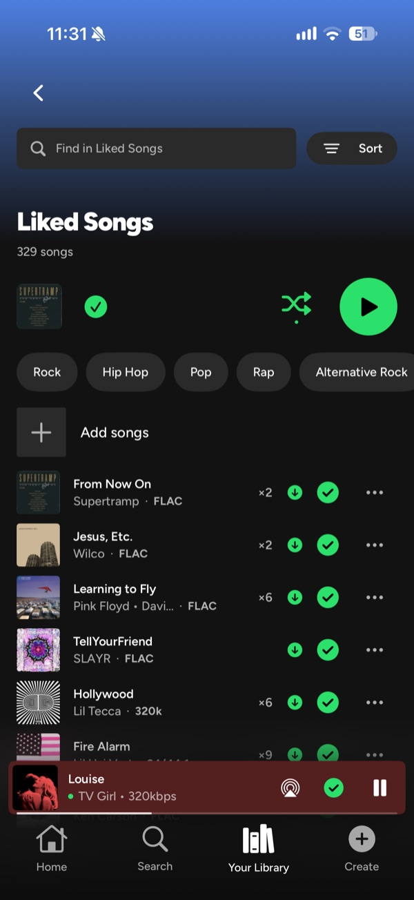
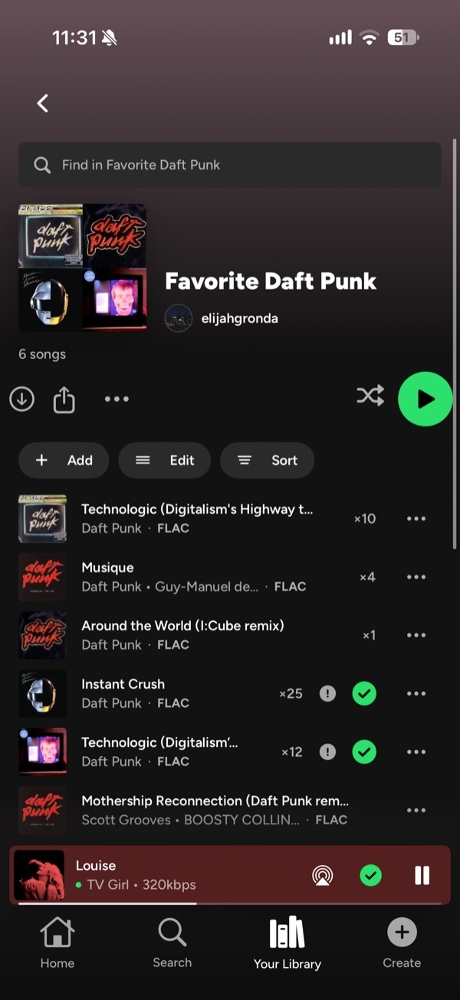
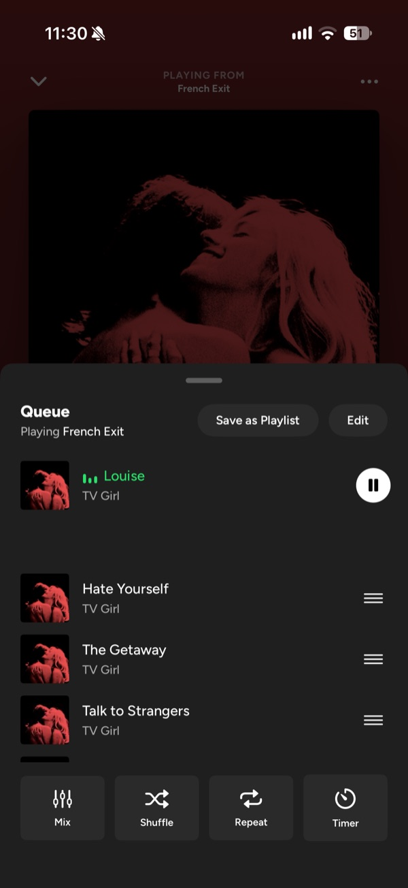
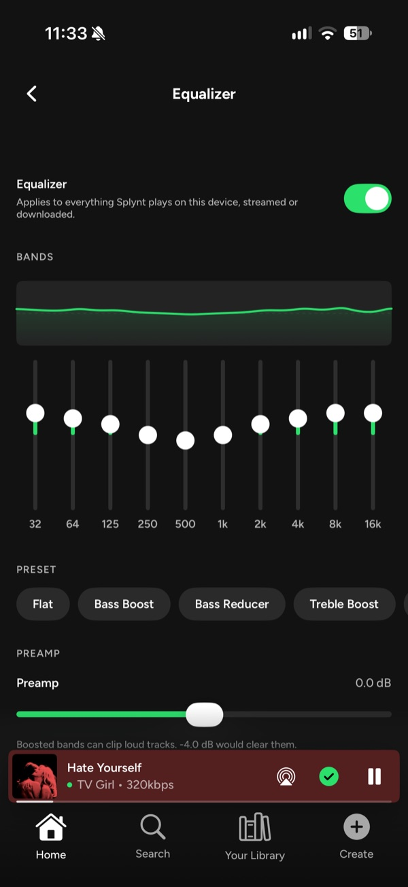

  

<h1 align="center">Splynt</h1>

  A Spotify-style client for your own
  <a href="https://www.navidrome.org/">Navidrome</a> or Subsonic server.

  Splynt is an independent project. It isn't affiliated with or endorsed by Spotify.

  <a href="https://testflight.apple.com/join/UWvEDqQc"><strong>Join the iPhone beta</strong></a>
  &nbsp;·&nbsp;
  <a href="https://github.com/elijahgronda/Splynt/releases/latest"><strong>Download for Windows or Linux</strong></a>
  &nbsp;·&nbsp;
  <a href="https://discord.gg/kkaZfRpsm"><strong>Discord</strong></a>

  
  
  
  

  
  
  
  

---

Splynt is a Navidrome client that has a very familiar UI. There are currently 2 main builds, one for iOS and one for Desktop.

I've been using it as my main player for a while now, so it's pretty polished.
I put out updates pretty often though, so there are still a lot of things I'm
ironing out. If you run into anything, let me know in the
[Discord](https://discord.gg/kkaZfRpsm).

## Features

- **Gapless and crossfade playback.** Albums play straight through, or you can
  fade songs into each other.
- **Audio equalizer.** Ten bands, twelve presets and a preamp. It works on
  everything, streamed or downloaded.
- **Library search AND indexed lyric search.** Splynt indexes your lyrics, so
  you can find a song from just a line you remember.
- **Synced lyrics.** They follow along with the song, under the player or full
  screen.
- **Artist discography pages.** Every release, their popular songs, and how
  many times you've played each one.
- **Daily Mixes based on your listening.** Splynt has its own recommendation
  engine for these. It's not perfect yet, and it can take a little bit to index
  your library before they show up. You can turn the row off if you'd rather
  not have it.
- **Playlist suggestions.** Ten songs that fit the playlist show up at the
  bottom of your playlists. Add one and a new one pops into its spot.
- **Widgets.** One for what's playing and one for your listening stats.
- **Adjustable home feeds.** Pick what shows up on Home.

There's also offline downloads, play counts, a sleep timer, the audio format on
every track, and you can save your queue as a playlist.

## Get Splynt

| Device | How |
| --- | --- |
| iPhone | Beta on [TestFlight](https://testflight.apple.com/join/UWvEDqQc). An App Store release is planned! |
| Windows | `.exe` or `.msi` from the [latest release](https://github.com/elijahgronda/Splynt/releases/latest) |
| Linux | `.AppImage` or `.deb` from the [latest release](https://github.com/elijahgronda/Splynt/releases/latest) |
| macOS | [Test builds](https://github.com/elijahgronda/Splynt/actions/workflows/desktop-installers.yml) or [build it from source](SplyntDesktop/README.md#building-on-a-mac) |
| Apple TV and Apple Watch | in progress |

The Windows installers aren't signed yet, so Windows might warn you the first time
you open one. Hit **More info**, then **Run anyway**.

## Desktop

The desktop app is free and open source, and all of its code is right here.
It's built to work like Spotify on desktop: your library on the left, Home and
search up top, and the player along the bottom. It has the same gapless,
crossfade, equalizer, synced lyrics and discography pages as the iPhone app,
plus listening stats and Splynt Connect so you can pass playback between your
computers.

It's made with Tauri 2, React and Rust. If you want to build it yourself, the
steps are in [SplyntDesktop/README.md](SplyntDesktop/README.md).

## Bugs and feature requests

Post them in the [Discord](https://discord.gg/kkaZfRpsm) forums! If it's a
bug, sending your log helps a ton:

- **iPhone:** Settings, About, Export Debug Log
- **Desktop:** Settings, Diagnostics, Show log

## Docs

- [Changelog](CHANGELOG.md)
- [Desktop UX spec](docs/desktop/DESKTOP-UX-SPEC.md), how the desktop app is
  supposed to behave
- [Splynt Connect](docs/connect/README.md) and its
  [wire protocol](docs/connect/WIRE-V1.md), how Splynt apps find each other and
  pass playback around on your network

## License

The desktop app is [GPL-3.0 or later](LICENSE). Use it, change it, share it!
If you share a modified version, it has to stay GPL with the source available.

The iPhone, Apple TV and Apple Watch apps are separate and closed source, so
they're not in here and this license doesn't cover them.
